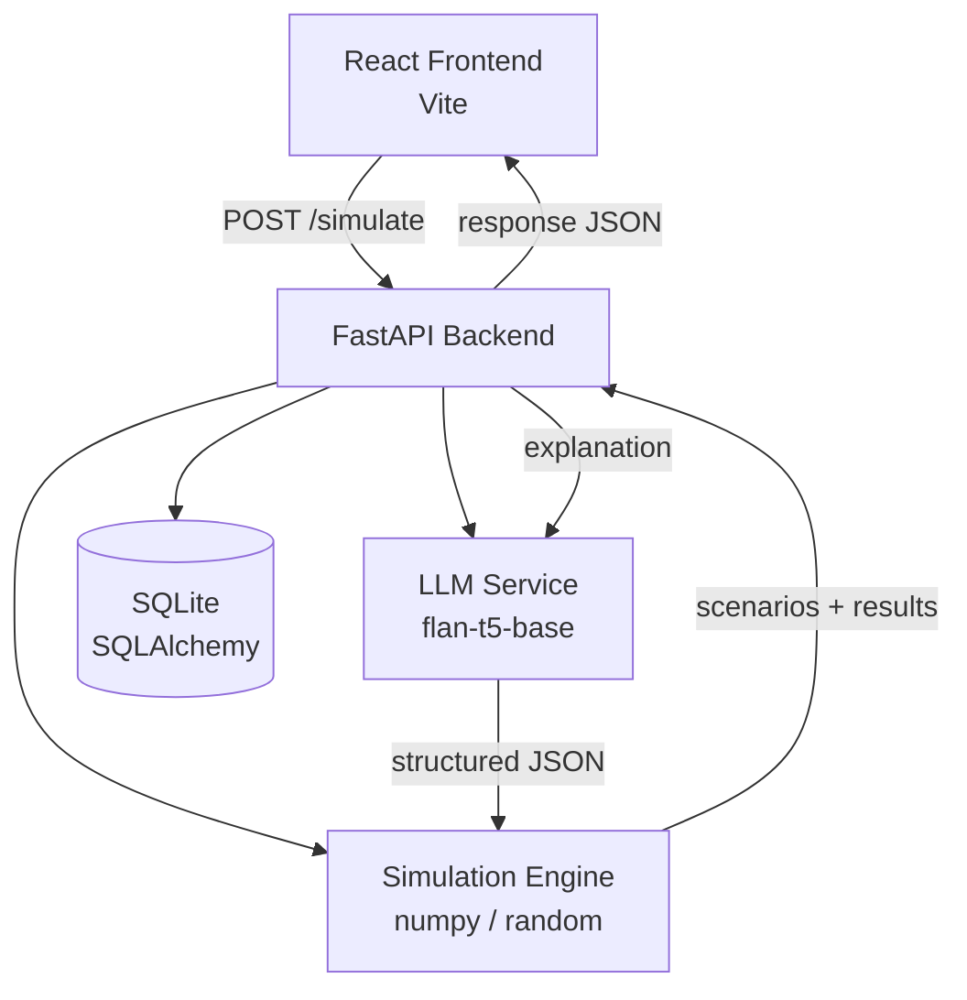
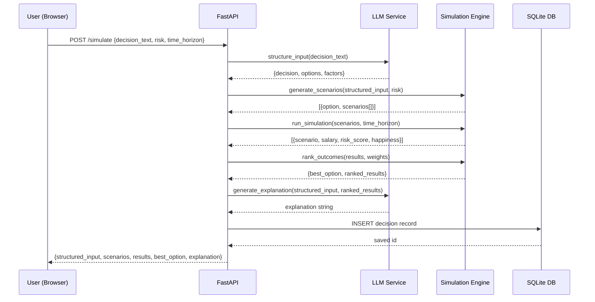

# Design Document: Decision Simulator (Parallel Universe Engine)

## Overview

The Decision Simulator is a local MVP that takes a user's decision as natural language input and simulates multiple parallel outcome scenarios using a locally-run LLM (google/flan-t5-base) combined with probabilistic logic. The system structures the decision, generates plausible scenarios per option, runs Monte Carlo-style simulations for each scenario, ranks outcomes by user-defined weights, and produces a natural language explanation — all without any external API calls.

The architecture is a React (Vite) frontend communicating with a FastAPI backend. SQLite via SQLAlchemy persists each simulation run. The HuggingFace model is loaded once at startup as a singleton to avoid repeated cold-start overhead.

## Architecture



## Sequence Diagrams

### Main Simulation Flow



## Components and Interfaces

### Component 1: LLM Service (`services/llm_service.py`)

**Purpose**: Wraps the HuggingFace flan-t5-base model. Handles prompt engineering for two tasks — input structuring and explanation generation. Loaded once as a module-level singleton.

**Interface**:
```python
class LLMService:
    def structure_input(self, decision_text: str) -> dict:
        """
        Prompt the model to extract decision, options, and factors.
        Returns: {"decision": str, "options": [str], "factors": [str]}
        """

    def generate_explanation(self, structured: dict, best_option: str, results: list) -> str:
        """
        Prompt the model to produce a human-readable explanation of the best outcome.
        Returns: plain text explanation string
        """
```

**Responsibilities**:
- Load model and tokenizer once at import time (singleton pattern)
- Build prompt strings for each task using constrained prompting (e.g., "Return ONLY valid JSON. No text outside JSON.")
- Extract JSON from model output using regex (`re.search(r'\{.*\}', output, re.DOTALL)`) before attempting `json.loads`
- Handle malformed model output gracefully with fallback defaults — never raises
- For explanation generation, pass only `best_option` and top 2–3 ranked scenarios (not full results) to keep the prompt focused and reduce noise

---

### Component 2: Simulation Engine (`simulation.py`)

**Purpose**: Generates probabilistic scenarios per option and runs numerical simulations for each. Computes weighted outcome scores and ranks options.

**Interface**:
```python
def generate_scenarios(structured_input: dict, risk_tolerance: float) -> list[dict]:
    """
    Returns 2-3 scenarios per option with assigned probabilities.
    """

def run_simulation(scenarios: list[dict], time_horizon: int) -> list[dict]:
    """
    For each scenario, simulate salary, risk_score, happiness using numpy random.
    Returns list of result dicts per scenario.
    """

def rank_outcomes(results: list[dict], weights: dict, risk_tolerance: float) -> dict:
    """
    Aggregates scores at the option level using probability-weighted scenario scores.
    risk_weight is derived as (1 - risk_tolerance) — user preference drives penalty.
    Salary is normalized dynamically using min/max of actual simulated salaries.
    option_score = sum(scenario_score * scenario_probability) for all scenarios of that option.
    Returns {"best_option": str, "ranked": [sorted option-level aggregates], "scenario_results": results}
    """
```

**Responsibilities**:
- Assign scenario probabilities influenced by user risk tolerance
- Set `np.random.seed(42)` at simulation start for reproducibility and debuggability
- Apply per-scenario scoring formula with configurable weights
- Aggregate to option level: `option_score = sum(score * probability)` — ensures best *option* wins, not just the luckiest scenario
- Return deterministic ranking given the fixed seed

---

### Component 3: FastAPI App (`main.py`)

**Purpose**: Single POST endpoint `/simulate` that orchestrates the full pipeline and persists results.

**Interface**:
```python
@app.post("/simulate", response_model=SimulationResponse)
async def simulate(request: SimulationRequest) -> SimulationResponse:
    ...
```

**Responsibilities**:
- Validate request via Pydantic schema
- Orchestrate LLM → Simulation → Ranking → Explanation pipeline
- Persist decision + result to SQLite
- Return full response JSON

---

### Component 4: React Frontend (`src/`)

**Purpose**: Two-page UI. Page 1 collects input; Page 2 displays results.

**Responsibilities**:
- Render decision text input, risk slider (0–1), time horizon number input
- POST to `/simulate` and handle loading/error states
- Display scenarios table, ranked results, best option highlight, and explanation text

---

## Data Models

### Request Schema (`schemas.py`)

```python
class SimulationRequest(BaseModel):
    decision_text: str          # e.g. "Should I switch jobs?"
    risk: float                 # 0.0 – 1.0
    time_horizon: int           # years, e.g. 3

class SimulationResponse(BaseModel):
    structured_input: dict      # {decision, options, factors}
    scenarios: list[dict]       # [{option, scenarios: [{name, probability}]}]
    results: list[dict]         # [{scenario, salary, risk_score, happiness, score}]
    best_option: str
    explanation: str
```

### Database Model (`models.py`)

```python
class Decision(Base):
    __tablename__ = "decisions"

    id: int                     # primary key, autoincrement
    decision_text: str          # original user input
    structured_json: str        # JSON string of structured_input
    result_json: str            # JSON string of full response
    created_at: datetime        # UTC timestamp, default=now
```

**Validation Rules**:
- `decision_text` must be non-empty
- `risk` must be in range [0.0, 1.0]
- `time_horizon` must be a positive integer ≥ 1

---

## Algorithmic Pseudocode

### Input Structuring Algorithm

```pascal
PROCEDURE structure_input(decision_text)
  INPUT: decision_text: String
  OUTPUT: structured: Dict

  SEQUENCE
    // Constrained prompt: instruct model to return ONLY JSON
    prompt ← "Return ONLY valid JSON, no other text.\n" +
              "Extract from: '" + decision_text + "'\n" +
              "Format: {\"decision\": \"...\", \"options\": [\"...\", \"...\"], \"factors\": [\"...\"]}"
    raw_output ← llm_model.generate(prompt, max_new_tokens=200)
    
    TRY
      // Regex extraction: find first {...} block to handle extra model chatter
      json_match ← regex_search(r'\{.*\}', raw_output, flags=DOTALL)
      IF json_match IS NULL THEN RAISE ParseError END IF
      
      structured ← parse_json(json_match.group(0))
      ASSERT "decision" IN structured
      ASSERT "options" IN structured AND len(structured.options) >= 2
      ASSERT "factors" IN structured AND len(structured.factors) >= 1
    CATCH ParseError OR AssertionError
      LOG warning("LLM output unparseable, using fallback")
      structured ← {
        "decision": decision_text,
        "options": ["proceed", "do not proceed"],
        "factors": ["risk", "reward"]
      }
    END TRY
    
    RETURN structured
  END SEQUENCE
END PROCEDURE
```

**Preconditions:**
- `decision_text` is a non-empty string
- LLM model is loaded and available

**Postconditions:**
- Returns dict with keys: `decision`, `options` (≥2 items), `factors` (≥1 item)
- Never raises — regex extraction + fallback guarantee a valid return value

---

### Scenario Generation Algorithm

```pascal
PROCEDURE generate_scenarios(structured_input, risk_tolerance)
  INPUT: structured_input: Dict, risk_tolerance: Float [0,1]
  OUTPUT: scenario_list: List[Dict]

  SEQUENCE
    scenario_list ← []
    
    FOR each option IN structured_input.options DO
      scenarios ← []
      remaining_prob ← 1.0
      scenario_templates ← get_templates(option, risk_tolerance)
      
      assigned_probs ← []
      FOR i FROM 0 TO len(scenario_templates) - 2 DO
        prob ← sample_probability(risk_tolerance, remaining_prob)
        prob ← round(prob, 2)
        scenarios.append({
          "name": scenario_templates[i],
          "probability": prob
        })
        assigned_probs.append(prob)
        remaining_prob ← remaining_prob - prob
      END FOR
      
      // Last scenario gets exact remainder to guarantee sum = 1.0
      // Do NOT round — use 1.0 - sum(assigned_probs) directly
      last_prob ← round(1.0 - sum(assigned_probs), 4)
      scenarios.append({
        "name": scenario_templates[-1],
        "probability": last_prob
      })
      
      scenario_list.append({
        "option": option,
        "scenarios": scenarios
      })
    END FOR
    
    RETURN scenario_list
  END SEQUENCE
END PROCEDURE
```

**Preconditions:**
- `structured_input.options` has ≥ 2 items
- `risk_tolerance` ∈ [0.0, 1.0]

**Postconditions:**
- Each option has 2–3 scenarios
- Probabilities per option sum to exactly 1.0 — last probability is `1.0 - sum(assigned_probs)`, not independently rounded
- Higher `risk_tolerance` increases variance in probability distribution

**Loop Invariants:**
- `assigned_probs` grows by one element per iteration
- All appended scenario probabilities are > 0

---

### Simulation Algorithm

```pascal
PROCEDURE run_simulation(scenario_list, time_horizon)
  INPUT: scenario_list: List[Dict], time_horizon: Int
  OUTPUT: results: List[Dict]

  SEQUENCE
    numpy.random.seed(42)   // Fix seed for reproducibility
    results ← []
    
    FOR each option_block IN scenario_list DO
      FOR each scenario IN option_block.scenarios DO
        // Scenario-aware salary ranges (ties simulation to semantic meaning)
        scenario_name_lower ← lowercase(scenario.name)
        
        IF "high growth" OR "promotion" OR "success" IN scenario_name_lower THEN
          salary_multiplier ← numpy.random.uniform(1.3, 2.0)
        ELSE IF "stressful" OR "risk" OR "struggle" IN scenario_name_lower THEN
          salary_multiplier ← numpy.random.uniform(0.8, 1.1)
        ELSE  // neutral / baseline
          salary_multiplier ← numpy.random.uniform(1.0, 1.4)
        END IF
        
        base_salary ← numpy.random.uniform(40000, 80000)
        salary ← base_salary * salary_multiplier * (1 + 0.05 * time_horizon)
        
        // Scenario-aware risk and happiness
        IF "high growth" OR "success" IN scenario_name_lower THEN
          risk_score ← numpy.random.uniform(0.4, 0.8)
          happiness  ← numpy.random.uniform(0.6, 1.0)
        ELSE IF "stressful" OR "struggle" IN scenario_name_lower THEN
          risk_score ← numpy.random.uniform(0.6, 1.0)
          happiness  ← numpy.random.uniform(0.2, 0.6)
        ELSE
          risk_score ← numpy.random.uniform(0.2, 0.6)
          happiness  ← numpy.random.uniform(0.4, 0.8)
        END IF
        
        results.append({
          "option": option_block.option,
          "scenario": scenario.name,
          "probability": scenario.probability,
          "salary": round(salary, 2),
          "risk_score": round(risk_score, 2),
          "happiness": round(happiness, 2)
        })
      END FOR
    END FOR
    
    RETURN results
  END SEQUENCE
END PROCEDURE
```

**Preconditions:**
- `scenario_list` is non-empty
- `time_horizon` ≥ 1

**Postconditions:**
- Each result entry contains: option, scenario, probability, salary, risk_score, happiness
- `salary` is scaled by both scenario-type multiplier and time_horizon growth factor
- Salary ranges are semantically tied to scenario names (high growth → higher salary)
- All float fields are rounded to 2 decimal places
- Output is deterministic given `seed(42)`

---

### Outcome Ranking Algorithm

```pascal
PROCEDURE rank_outcomes(results, weights, risk_tolerance)
  INPUT: results: List[Dict], weights: Dict {salary_w, happiness_w}, risk_tolerance: Float [0,1]
  OUTPUT: ranking: Dict {best_option, ranked, scenario_results}

  SEQUENCE
    // Derive risk_weight from user preference: risk-averse users penalize risk more
    risk_w ← 1.0 - risk_tolerance

    // Step 1: Compute dynamic salary normalization bounds from actual data
    all_salaries ← [r.salary FOR r IN results]
    min_salary ← min(all_salaries)
    max_salary ← max(all_salaries)
    salary_range ← max_salary - min_salary
    IF salary_range == 0 THEN salary_range ← 1  // avoid division by zero

    // Step 2: Score each scenario using dynamic normalization + derived risk weight
    FOR each result IN results DO
      norm_salary ← (result.salary - min_salary) / salary_range
      result.score ← (
        weights.salary_w * norm_salary +
        weights.happiness_w * result.happiness -
        risk_w * result.risk_score
      )
    END FOR
    
    // Step 3: Aggregate to option level using probability-weighted scores
    // This ensures we pick the best OPTION, not just the luckiest scenario
    option_scores ← {}
    FOR each result IN results DO
      option ← result.option
      IF option NOT IN option_scores THEN
        option_scores[option] ← 0.0
      END IF
      option_scores[option] ← option_scores[option] + (result.score * result.probability)
    END FOR
    
    // Step 4: Rank options by aggregated score
    ranked_options ← sort(option_scores.items(), key=value, descending=True)
    best_option ← ranked_options[0].option
    
    // Step 5: Also return scenario-level results sorted by score (for display)
    ranked_scenarios ← sort(results, key=score, descending=True)
    
    RETURN {
      "best_option": best_option,
      "ranked": ranked_options,             // option-level aggregates
      "scenario_results": ranked_scenarios  // scenario-level detail for UI
    }
  END SEQUENCE
END PROCEDURE
```

**Preconditions:**
- `results` is non-empty
- Each result has keys: `salary`, `happiness`, `risk_score`, `probability`
- `weights` contains `salary_w` and `happiness_w` (non-negative)
- `risk_tolerance` ∈ [0.0, 1.0]

**Postconditions:**
- `risk_w` is derived as `1.0 - risk_tolerance` — user risk preference fully drives penalty weight
- Salary is normalized dynamically using `min/max` of actual simulated salaries (not static bounds)
- Every result has a `score` field
- `ranked[0].score >= ranked[i].score` for all `i > 0` (option-level)
- `best_option` is determined by probability-weighted aggregation across all its scenarios
- `best_option == ranked[0]["option"]`

---

## Key Functions with Formal Specifications

### `LLMService.structure_input(decision_text)`

**Preconditions:**
- `decision_text` is a non-empty string
- `self._model` and `self._tokenizer` are initialized

**Postconditions:**
- Returns dict with keys `decision`, `options`, `factors`
- `options` list has ≥ 2 elements
- Never raises an exception (fallback on parse error)

**Loop Invariants:** N/A

---

### `generate_scenarios(structured_input, risk_tolerance)`

**Preconditions:**
- `len(structured_input["options"]) >= 2`
- `0.0 <= risk_tolerance <= 1.0`

**Postconditions:**
- Returns list of length equal to `len(structured_input["options"])`
- For each entry: `sum(s["probability"] for s in entry["scenarios"]) == 1.0`
- Each option has 2 or 3 scenarios

**Loop Invariants:**
- `remaining_prob >= 0` at start of each inner loop iteration

---

### `rank_outcomes(results, weights, risk_tolerance)`

**Preconditions:**
- `len(results) > 0`
- Each result has keys: `salary`, `happiness`, `risk_score`, `probability`
- `weights` contains `salary_w`, `happiness_w` (non-negative)
- `risk_tolerance` ∈ [0.0, 1.0]

**Postconditions:**
- `risk_w` is always `1.0 - risk_tolerance` — user preference fully drives risk penalty
- Salary normalization uses `min/max` of actual `results` salaries (dynamic, not static bounds)
- `best_option` is determined by probability-weighted aggregation: `option_score = sum(score * probability)`
- `ranked[0].score >= ranked[i].score` for all `i > 0` (at option level)
- `best_option == ranked[0]["option"]`
- `scenario_results` contains all scenario-level results sorted by score for UI display

---

## Example Usage

```python
# Backend pipeline (inside POST /simulate handler)

llm = LLMService()  # singleton, loaded at startup

# Step 1: Structure the input
structured = llm.structure_input("Should I switch jobs?")
# → {"decision": "Switch jobs", "options": ["Switch job", "Stay"], "factors": ["salary", "growth", "risk"]}

# Step 2: Generate scenarios
scenarios = generate_scenarios(structured, risk_tolerance=0.6)
# → [{"option": "Switch job", "scenarios": [{"name": "High growth", "probability": 0.5}, ...]}, ...]

# Step 3: Simulate outcomes
results = run_simulation(scenarios, time_horizon=3)
# → [{"option": "Switch job", "scenario": "High growth", "salary": 98500.0, "risk_score": 0.72, "happiness": 0.85}, ...]

# Step 4: Rank — risk_weight derived from user preference, salary normalized dynamically
weights = {"salary_w": 0.4, "happiness_w": 0.4}  # risk_w = 1 - risk_tolerance = 0.4
ranking = rank_outcomes(results, weights, risk_tolerance=0.6)
# → {"best_option": "Switch job", "ranked": [...]}

# Step 5: Explain — pass only best_option + top 2-3 scenarios (not full results)
top_scenarios = ranking["scenario_results"][:3]
explanation = llm.generate_explanation(structured, ranking["best_option"], top_scenarios)
# → "Switching jobs offers higher salary potential and growth, though it carries elevated short-term risk."
```

---

## Correctness Properties

*A property is a characteristic or behavior that should hold true across all valid executions of a system — essentially, a formal statement about what the system should do. Properties serve as the bridge between human-readable specifications and machine-verifiable correctness guarantees.*

### Property 1: Scenario probability sum invariant

*For any* valid `structured_input` with N options and any `risk_tolerance` in [0.0, 1.0], calling `generate_scenarios` must return exactly N option groups where the scenario probabilities within each group sum to exactly 1.0.

**Validates: Requirements 3.2, 3.3**

---

### Property 2: Ranking non-increasing order

*For any* non-empty `results` list and any valid `weights` and `risk_tolerance`, calling `rank_outcomes` must return a `ranked` list where `ranked[0].score >= ranked[i].score` for all `i > 0`, and `best_option` equals `ranked[0]["option"]`.

**Validates: Requirements 5.6, 5.7**

---

### Property 3: Risk weight derivation

*For any* `risk_tolerance` in [0.0, 1.0], `rank_outcomes` must compute `risk_w` as exactly `1.0 - risk_tolerance`.

**Validates: Requirements 5.1**

---

### Property 4: Dynamic salary normalization

*For any* `results` list with known salary values, `rank_outcomes` must normalize salaries using the minimum and maximum salary values present in that specific results list, not static bounds.

**Validates: Requirements 5.2, 5.3**

---

### Property 5: Probability-weighted option aggregation

*For any* `results` list, `rank_outcomes` must compute each option's aggregate score as `sum(scenario_score * scenario_probability)` across all scenarios belonging to that option.

**Validates: Requirements 5.5**

---

### Property 6: LLM structuring always returns valid dict

*For any* non-empty `decision_text`, including cases where the LLM produces malformed or unparseable output, `structure_input` must return a dict containing keys `decision`, `options` (with ≥ 2 elements), and `factors` (with ≥ 1 element) without raising an exception.

**Validates: Requirements 2.1, 2.2, 2.3, 2.4**

---

### Property 7: Simulation output value invariants

*For any* valid scenario list and `time_horizon >= 1`, every result produced by `run_simulation` must have `salary > 0`, `risk_score` in [0.0, 1.0], and `happiness` in [0.0, 1.0].

**Validates: Requirements 4.2, 4.3, 4.4**

---

### Property 8: Semantic salary ranges

*For any* scenario whose name contains high-growth keywords ("high growth", "promotion", "success"), the salary multiplier applied by `run_simulation` must be sampled from [1.3, 2.0]; for stressful keywords ("stressful", "risk", "struggle") from [0.8, 1.1]; otherwise from [1.0, 1.4].

**Validates: Requirements 4.5, 4.6, 4.7**

---

### Property 9: Simulation determinism

*For any* identical scenario list and `time_horizon`, calling `run_simulation` twice must produce identical results because `numpy.random.seed(42)` is set before sampling.

**Validates: Requirements 4.1**

---

### Property 10: Request validation rejects out-of-range inputs

*For any* request where `risk` is outside [0.0, 1.0], `time_horizon` is less than 1, or `decision_text` is empty, the API must return HTTP 422 without invoking the simulation pipeline.

**Validates: Requirements 1.1, 1.2, 1.3**

---

## Error Handling

### LLM Parse Failure

**Condition**: Model output is not valid JSON or missing required keys
**Response**: Log warning, return hardcoded fallback structured dict
**Recovery**: Pipeline continues normally with fallback data

### Simulation with Zero Options

**Condition**: `structured_input["options"]` is empty after LLM structuring
**Response**: Fallback ensures at least `["proceed", "do not proceed"]`
**Recovery**: Simulation proceeds with default options

### Database Write Failure

**Condition**: SQLite write fails (disk full, lock timeout)
**Response**: Log error, but still return simulation response to user
**Recovery**: Result is not persisted; user still gets their simulation output

### Invalid Request

**Condition**: `risk` outside [0,1] or `time_horizon` < 1 or empty `decision_text`
**Response**: FastAPI returns HTTP 422 Unprocessable Entity with Pydantic validation details
**Recovery**: User corrects input and resubmits

---

## Testing Strategy

### Unit Testing Approach

- Test `generate_scenarios` with fixed numpy seed — assert probability sums and scenario counts
- Test `rank_outcomes` with hand-crafted result lists — assert sort order and best_option correctness
- Test `structure_input` fallback — mock model to return invalid JSON, assert fallback dict returned
- Test Pydantic schemas — assert validation errors for out-of-range `risk` and negative `time_horizon`

### Property-Based Testing Approach

**Property Test Library**: hypothesis (Python)

- Property: For any valid `structured_input` with N options, `generate_scenarios` returns exactly N entries, each with probabilities summing to 1.0
- Property: For any non-empty `results` list, `rank_outcomes` returns a list sorted in non-increasing score order
- Property: For any `time_horizon >= 1`, simulated `salary` is always positive

### Integration Testing Approach

- Test full `/simulate` endpoint with a real (or mocked) LLM service using FastAPI `TestClient`
- Assert response shape matches `SimulationResponse` schema
- Assert SQLite record is created after each successful call

---

## Performance Considerations

- flan-t5-base loads in ~2–5 seconds on CPU; singleton pattern ensures this happens once at startup, not per request
- Inference per request takes ~1–3 seconds on CPU for short prompts — acceptable for an MVP
- numpy random sampling is negligible in cost
- SQLite is sufficient for local single-user MVP; no connection pooling needed

---

## Security Considerations

- No authentication required for local MVP
- User input is passed to the LLM as a prompt — no SQL injection risk since it's not used in raw queries (SQLAlchemy ORM handles parameterization)
- Prompt injection is a theoretical concern but out of scope for local MVP
- CORS should be configured in FastAPI to allow only `localhost` origins

---

## Dependencies

| Package | Purpose |
|---|---|
| `fastapi` | HTTP API framework |
| `uvicorn` | ASGI server |
| `sqlalchemy` | ORM for SQLite |
| `pydantic` | Request/response validation |
| `transformers` | HuggingFace model loading |
| `torch` | PyTorch backend for transformers |
| `numpy` | Probabilistic simulation |
| `react` + `vite` | Frontend framework and build tool |
| `axios` | HTTP client in React |
